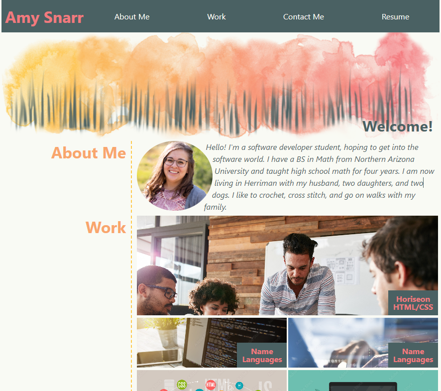

# My Portfolio

## Name
Snarr Portfolio

## Description
This is my submission for Module 2 project. This project shows a page that contains
different projects that I've been working on, a small bio about me, and links for
how to get in touch with me. This page can be comfortably viewed on a phone, tablet, or desktop. To view the project
on GitHub Pages, click <a href="https://sifrult.github.io/snarr-portfolio/" target="_blank">here</a>.

## Visuals

